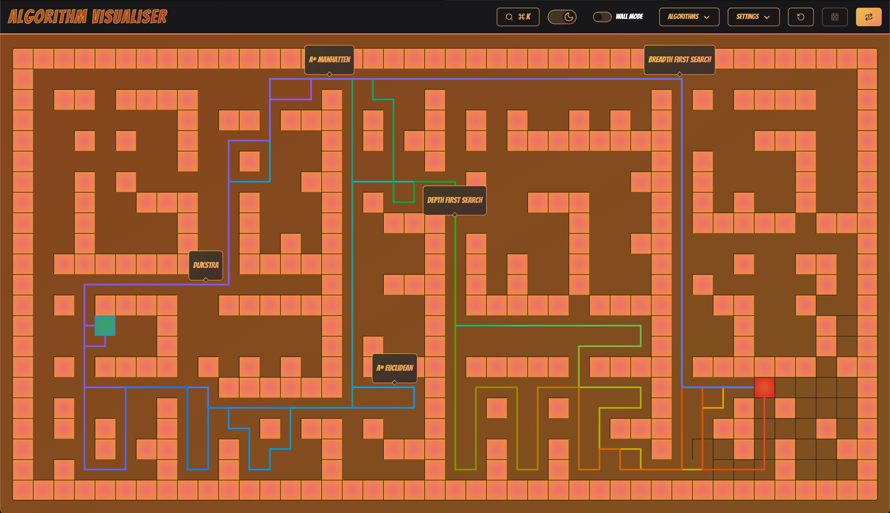

<!-- Improved compatibility of back to top link: See: https://github.com/othneildrew/Best-README-Template/pull/73 -->

<a id="readme-top"></a>

<!--
*** Thanks for checking out the Best-README-Template. If you have a suggestion
*** that would make this better, please fork the repo and create a pull request
*** or simply open an issue with the tag "enhancement".
*** Don't forget to give the project a star!
*** Thanks again! Now go create something AMAZING! :D
-->

<!-- PROJECT SHIELDS -->
<!--
*** I'm using markdown "reference style" links for readability.
*** Reference links are enclosed in brackets [ ] instead of parentheses ( ).
*** See the bottom of this document for the declaration of the reference variables
*** for contributors-url, forks-url, etc. This is an optional, concise syntax you may use.
*** https://www.markdownguide.org/basic-syntax/#reference-style-links
-->

[![Contributors][contributors-shield]][contributors-url]
[![Forks][forks-shield]][forks-url]
[![Stargazers][stars-shield]][stars-url]
[![Issues][issues-shield]][issues-url]
[![project_license][license-shield]][license-url]
[![LinkedIn][linkedin-shield]][linkedin-url]

<!-- PROJECT LOGO -->
<br />
<div align="center">
  <a href="https://algovi.netlify.app">
    <picture>
      <source srcset="images/logo-light.png" media="(prefers-color-scheme: dark)">
      
    </picture>
  </a>

<h3 align="center">Algovi</h3>

  <p align="center">
    A rebuild of a passion project I built with a friend in 2020.    
    <br />
    <br />
    <a href="https://algovi.netlify.app">View it here</a>
    &middot;
    <a href="https://github.com/basselalsayed/algo-visualiser-v2/issues/new?labels=bug&template=bug-report---.md">Report Bug</a>
    &middot;
    <a href="https://github.com/basselalsayed/algo-visualiser-v2/issues/new?labels=enhancement&template=feature-request---.md">Request Feature</a>
    &middot;
    <a href="https://github.com/Walker-TW/Algorithm-Visualizer">View the original</a>
  </p>
</div>

<!-- TABLE OF CONTENTS -->
<details>
  <summary>Table of Contents</summary>
  <ol>
    <li>
      <a href="#about-the-project">About The Project</a>
      <ul>
        <li><a href="#built-with">Built With</a></li>
      </ul>
    </li>
    <li>
      <a href="#getting-started">Getting Started</a>
      <ul>
        <li><a href="#prerequisites">Prerequisites</a></li>
        <li><a href="#installation">Installation</a></li>
      </ul>
    </li>
    <li><a href="#usage">Usage</a></li>
    <li><a href="#roadmap">Roadmap</a></li>
    <li><a href="#contributing">Contributing</a></li>
    <li><a href="#license">License</a></li>
    <li><a href="#contact">Contact</a></li>
    <li><a href="#acknowledgments">Acknowledgments</a></li>
  </ol>
</details>

<!-- ABOUT THE PROJECT -->

## About The Project

<div align="center">
  <picture>
    <source srcset="images/screenshot-light.png" media="(prefers-color-scheme: dark)">
      
  </picture>
</div>

Here's a blank template to get started. To avoid retyping too much info, do a search and replace with your text editor for the following: `basselalsayed`, `algo-visualiser-v2`, `twitter_handle`, `linkedin_username`, `email_client`, `email`, `project_title`, `project_description`, `project_license`

<p align="right">(<a href="#readme-top">back to top</a>)</p>

### Built With

- [![React][React.js]][React-url]
- [![TailwindCSS][TailwindCSS]][TailwindCSS-url]
- [![Zustand][Zustand]][Zustand-url]
- [![Vite][Vite]][Vite-url]
- [![Vitest][Vitest]][Vitest-url]
- [![shadcn/ui][shadcn/ui]][shadcn/ui-url]
- [![ts-pattern][ts-pattern]][ts-pattern-url]
- [![Supabase][Supabase]][Supabase-url]

<p align="right">(<a href="#readme-top">back to top</a>)</p>

<!-- GETTING STARTED -->

## Getting Started

This is an example of how you may give instructions on setting up your project locally.
To get a local copy up and running follow these simple example steps.

### Prerequisites

- Install node 20
  - [fnm](https://github.com/Schniz/fnm)
  - [nvm](https://github.com/nvm-sh/nvm)
  - [direct](https://nodejs.org/en/download)
- [Install pnpm](https://pnpm.io/installation)

### Installation

1. Clone the repo
   ```sh
   git clone https://github.com/basselalsayed/algo-visualiser-v2.git
   ```
1. Install NPM packages
   ```sh
   pnpm i
   ```
1. Development mode
   ```sh
   pnpm dev
   ```
1. Production mode
   ```sh
   pnpm preview
   ```
1. Change git remote url to avoid accidental pushes to base project
   ```sh
   git remote set-url origin basselalsayed/algo-visualiser-v2
   git remote -v # confirm the changes
   ```

<p align="right">(<a href="#readme-top">back to top</a>)</p>

<!-- USAGE EXAMPLES -->

## Usage

Use this space to show useful examples of how a project can be used. Additional screenshots, code examples and demos work well in this space. You may also link to more resources.

_For more examples, please refer to the [Documentation](https://example.com)_

<p align="right">(<a href="#readme-top">back to top</a>)</p>

<!-- ROADMAP -->

## Roadmap

- [x] MVP
  - [x] Salvage algorithms from v1
- [x] UI design
  - [x] Responsive
- [x] Pause visualisation mechanism via generators
- [x] Store run info locally
  - [x] Store run info in supabase
- [x] Keyboard shortcuts/quick search
- [x] Localisation (18 languages)
- [x] Guided tour via [shepherd.js](https://www.shepherdjs.dev/)
- [x] Linting
  - [x] Custom setup to prevent circular dependencies
- [x] Adjustable animation speed
- [x] Multiple shortest paths
- [x] Testing
  - [x] Vitest
  - [x] Playwright
- [x] CI - github actions
- [x] Handle touch gestures
- [x] Replace framer motion with native animations
  - [x] Smoother reset UX
- [ ] Update viable algorithms to work diagonally

See the [open issues](https://github.com/basselalsayed/algo-visualiser-v2/issues) for a full list of proposed features (and known issues).

<p align="right">(<a href="#readme-top">back to top</a>)</p>

<!-- CONTRIBUTING -->

## Contributing

Contributions are what make the open source community such an amazing place to learn, inspire, and create. Any contributions you make are **greatly appreciated**.

If you have a suggestion that would make this better, please fork the repo and create a pull request. You can also simply open an issue with the tag "enhancement".

1. Fork the Project
2. Create your Feature Branch (`git checkout -b feature/AmazingFeature`)
3. Commit your Changes (`git commit -m 'Add some AmazingFeature'`)
4. Push to the Branch (`git push origin feature/AmazingFeature`)
5. Open a Pull Request

<p align="right">(<a href="#readme-top">back to top</a>)</p>

<!-- LICENSE -->

## License

Distributed under the MIT license. See `LICENSE.txt` for more information.

<p align="right">(<a href="#readme-top">back to top</a>)</p>

<!-- CONTACT -->

## Contact

Bassel Al-Sayed - [@twitter_handle](https://twitter.com/twitter_handle) - email@email_client.com

Project Link: [https://github.com/basselalsayed/algo-visualiser-v2](https://github.com/basselalsayed/algo-visualiser-v2)

<p align="right">(<a href="#readme-top">back to top</a>)</p>

<!-- ACKNOWLEDGMENTS -->

## Acknowledgments

- [Tom Walker](https://github.com/Walker-TW)

<p align="right">(<a href="#readme-top">back to top</a>)</p>

<!-- MARKDOWN LINKS & IMAGES -->
<!-- https://www.markdownguide.org/basic-syntax/#reference-style-links -->

[contributors-shield]: https://img.shields.io/github/contributors/basselalsayed/algo-visualiser-v2.svg?style=for-the-badge
[contributors-url]: https://github.com/basselalsayed/algo-visualiser-v2/graphs/contributors
[forks-shield]: https://img.shields.io/github/forks/basselalsayed/algo-visualiser-v2.svg?style=for-the-badge
[forks-url]: https://github.com/basselalsayed/algo-visualiser-v2/network/members
[stars-shield]: https://img.shields.io/github/stars/basselalsayed/algo-visualiser-v2.svg?style=for-the-badge
[stars-url]: https://github.com/basselalsayed/algo-visualiser-v2/stargazers
[issues-shield]: https://img.shields.io/github/issues/basselalsayed/algo-visualiser-v2.svg?style=for-the-badge
[issues-url]: https://github.com/basselalsayed/algo-visualiser-v2/issues
[license-shield]: https://img.shields.io/github/license/basselalsayed/algo-visualiser-v2.svg?style=for-the-badge
[license-url]: https://github.com/basselalsayed/algo-visualiser-v2/blob/master/LICENSE.txt
[linkedin-shield]: https://img.shields.io/badge/-LinkedIn-black.svg?style=for-the-badge&logo=linkedin&colorB=555
[linkedin-url]: https://www.linkedin.com/in/bsas/
[product-screenshot]: images/screenshot.png
[netlify-url]: https://algovi.netlify.app
[React.js]: https://img.shields.io/badge/React-20232A?style=for-the-badge&logo=react&logoColor=61DAFB
[React-url]: https://reactjs.org/
[TailwindCSS]: https://img.shields.io/badge/TailwindCSS-38BDF8?style=for-the-badge&logo=tailwindcss&logoColor=white
[TailwindCSS-url]: https://tailwindcss.com/
[Zustand]: https://img.shields.io/badge/Zustand-000000?style=for-the-badge&logo=Zustand&logoColor=white
[Zustand-url]: https://zustand-demo.pmnd.rs/
[Vite]: https://img.shields.io/badge/Vite-646CFF?style=for-the-badge&logo=vite&logoColor=white
[Vite-url]: https://vitejs.dev/
[Vitest]: https://img.shields.io/badge/Vitest-6E9F18?style=for-the-badge&logo=vitest&logoColor=white
[Vitest-url]: https://vitest.dev/
[shadcn/ui]: https://img.shields.io/badge/shadcn/ui-111827?style=for-the-badge&logo=tailwindcss&logoColor=white
[shadcn/ui-url]: https://ui.shadcn.com/
[ts-pattern]: https://img.shields.io/badge/ts--pattern-3178C6?style=for-the-badge&logo=typescript&logoColor=white
[ts-pattern-url]: https://github.com/gvergnaud/ts-pattern
[Supabase]: https://img.shields.io/badge/Supabase-3ECF8E?style=for-the-badge&logo=supabase&logoColor=white
[Supabase-url]: https://supabase.com/
